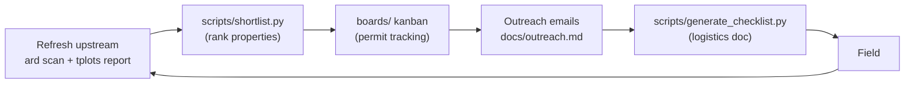

# dronescape-planning_and_permits

Permit tracking, trip logistics, and corridor shortlisting for the
[DroneScape](https://www.utas.edu.au/research/projects/terraluma/research/dronescape)
field campaign. Downstream of [tern_plots_master](https://github.com/jcmontes/tern_plots_master) —
see [Concept 12](https://github.com/jcmontes/tern_plots_master/blob/main/docs/concepts/12_fieldwork_planning_handoff.md).

**Parallel branch:** [dronescape-lidar-quicklook](https://github.com/jcmontes/dronescape-lidar-quicklook)
assesses LiDAR capture quality — complementary, not a dependency.

---

## The cycle



After fieldwork: `ds transfer` → `ard scan` → `tplots report` → re-run shortlist.

---

## What do you want to do?

| Goal | Open this |
|------|-----------|
| Plan or prep a trip end-to-end | [docs/workflow.md](docs/workflow.md) |
| Track permits on an active trip | `boards/NN-ORIG-DEST-Access-applications.md` in Obsidian |
| Draft or send an access email | [docs/outreach.md](docs/outreach.md) |
| SQL schema, queries, haversine UDF | [HANDOFF.md](HANDOFF.md) |
| 2026–2028 corridor roadmap | [docs/campaign-roadmap.md](docs/campaign-roadmap.md) |

---

## Database paths

| Database | Alias | Path | Writable? |
|----------|-------|------|-----------|
| `tern_plots.db` | `tp` | `C:/Users/jcmontes/Documents/GitHub/tern_plots_master/data/tern_plots.db` | No |
| `ard_state.db` | `ard` | `C:/Users/jcmontes/Documents/GitHub/dronescape_ard/data/ard_state.db` | No |
| `campaigns.db` | (main) | `./data/campaigns.db` | Yes |

Never write to `tp.*` or `ard.*` from this repo.

---

## Install

```powershell
# Full install (maps + DOCX generation) — recommended
pip install -e ".[all]"

# Bootstrap the local DB schema (once)
python scripts/seed_campaigns.py
```

Core scripts (`shortlist.py`, `trip_audit.py`, `seed_campaigns.py`) are stdlib-only and
work without installing anything.

---

## Repository layout

```
README.md                       ← you are here
HANDOFF.md                      ← SQL/Python cookbook
data/
  campaigns.db                  ← permit state (gitignored)
boards/                         ← Obsidian kanban per trip
docs/
  workflow.md                   ← end-to-end trip planning steps
  outreach.md                   ← email drafting guide
  campaign-roadmap.md           ← 2026–2028 corridor chain
  itineraries/                  ← CSV exports from shared Excel
  checklists/                   ← generated output (gitignored)
  drafts/                       ← shortlist briefs (gitignored)
  audits/                       ← trip_audit + feedback reports (gitignored)
  archive/                      ← ADRs + superseded docs
scripts/                        ← CLI launchers
src/dronescape_planning/        ← Python modules
templates/                      ← email skeleton
```
