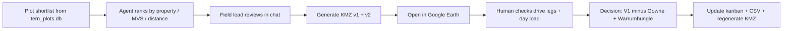

# 02-BRI-BRK itinerary decision — field lead + agent session (Jun 2026)

How the Brisbane → Broken Hill trip plan was chosen, how KMZ maps were used, and what to build next in this repo.

**Trip:** `02-BRI-BRK-2026-07`  
**Approved itinerary:** V1 coworker schedule (`BRISBANEtoBROKENHILL_V1_orig.xlsx`) with two field-lead edits  
**Kanban:** [boards/02-BRI-BRK-Access-applications.md](../../boards/02-BRI-BRK-Access-applications.md)  
**Logistics CSV:** [02-BRI-BRK-2026-07-itinerary.csv](../itineraries/02-BRI-BRK-2026-07-itinerary.csv)  
**Map:** [02-BRI-BRK-2026-07-plots-v1.kmz](../itineraries/maps/02-BRI-BRK-2026-07-plots-v1.kmz)

---

## Final decision (what we locked in)

| Change | Detail |
|--------|--------|
| **Keep** | Coworker V1 daily structure (Days 2–10, return 30 Jul) |
| **Remove** | `NSABBS0011` (Gowrie Ecofarm) — dropped after inspecting route density in Google Earth |
| **Add** | `NSABBS0001`, `NSABBS0002` (Warrumbungle NP) — permit approved on ADL-BRI but too late for that trip’s Excel rows; deferred per [field-day-policy.md](../field-day-policy.md) |
| **Reject (for now)** | V2 agent proposal (Fowlers Gap block, Melool deferral, +1 day) — useful exploration, not adopted |

**Result:** 26 plots · 11 properties · 9 outreach threads in **To Contact** + 1 carryover confirmed + 1 council awaiting.

---

## How the human + agent workflow went



### Step 1 — Data-backed shortlist (agent)

The agent queried `tern_plots.db` + `ard_state.db` to group plots by `tp.plots.property`, check uncollected status, MVS, and distance from Broken Hill / Brisbane. Output: prioritization by **plots per permit**, eastern corridor vs western cluster, and rare MVS.

### Step 2 — V2 proposal (agent)

A revised Excel/Obsidian itinerary was drafted (Fowlers Gap, unbundled Paroo days, extended return). Good for comparing leverage; field lead chose **not** to adopt it for this trip.

### Step 3 — KMZ generation (repo tool)

```powershell
python scripts/generate_trip_kml.py --trip-id 02-BRI-BRK-2026-07 --version v1
python scripts/generate_trip_kml.py --trip-id 01-ADL-BRI-2026-06 --csv docs/itineraries/01-ADL-BRI-2026-06-itinerary.csv
```

Script: `scripts/generate_trip_kml.py`

- One folder per **field day** (colour-coded pins)
- Trip anchors (Brisbane, Broken Hill, Adelaide)
- Straight-line **visit order** path (not road routing)
- Optional backup folder when built from CSV

### Step 4 — Google Earth review (human)

The field lead opened `.kmz` on Desktop in Google Earth and:

- Checked whether **Day 8** (Paroo + Melool + one Town Common plot) was realistic in one drive day
- Compared **V1 vs V2** western clusters (Fowlers Gap vs Melool singleton)
- Validated eastern leg order (SEQ → Torrington → Breeza/Wondoba)
- Decided Gowrie was low value for the detour on Day 5 vs adding **already-approved** Warrumbungle on the Gunnedah→Cobar leg

This human loop is **essential** — SQL proximity and plot counts cannot replace visual route sanity.

### Step 5 — Kanban + deferral (repo)

- [01-ADL-BRI-Access-applications.md](../../boards/01-ADL-BRI-Access-applications.md): Warrumbungle → **Access Confirmed** with `Deferred → 02-BRI-BRK-2026-07`
- [02-BRI-BRK-Access-applications.md](../../boards/02-BRI-BRK-Access-applications.md): property cards in **To Contact** (ready for email) + Warrumbungle in **Access Confirmed**

---

## What to build next (for the next agent)

| Priority | Feature | Notes |
|----------|---------|-------|
| 1 | **`generate_trip_kml.py --csv`** for BRI-BRK | Already works for ADL-BRI; point at `02-BRI-BRK-2026-07-itinerary.csv` so KMZ stays in sync with Excel/CSV |
| 2 | **Itinerary import** | `import_itinerary.py --trip-id 02-BRI-BRK-2026-07 --csv ...` → `campaign_plots` + feedback markdown |
| 3 | **Kanban ↔ CSV sync** | When daily rows change, regenerate KMZ and run `itinerary_feedback.py` |
| 4 | **Deferral helper** | Flag carryover plots (Warrumbungle pattern) when moving cards between trip boards |
| 5 | **Optional** | Road routing (OSRM/Google Directions) instead of straight-line visit path in KML |

### Suggested agent prompt (copy-paste)

> Read `docs/planning-notes/02-BRI-BRK-itinerary-decision.md` and `boards/02-BRI-BRK-Access-applications.md`. Regenerate KMZ from `docs/itineraries/02-BRI-BRK-2026-07-itinerary.csv`. Run itinerary import dry-run. Draft NPWS email for Paroo Darling using `templates/email-template-nationalpark.md`.

---

## File index (artifacts from this session)

| File | Purpose |
|------|---------|
| `docs/itineraries/02-BRI-BRK-2026-07-itinerary.csv` | Approved logistics snapshot |
| `docs/itineraries/maps/02-BRI-BRK-2026-07-plots-v1.kmz` | Google Earth map (approved plan) |
| `scripts/generate_trip_kml.py` | KML/KMZ generator (`--version v1/v2` or `--csv`) |
| `boards/02-BRI-BRK-Access-applications.md` | Permit workflow — start emails from **To Contact** |

---

*Session: Jun 2026 · Field lead: Juan Carlos · Agent: Cursor planning repo*
