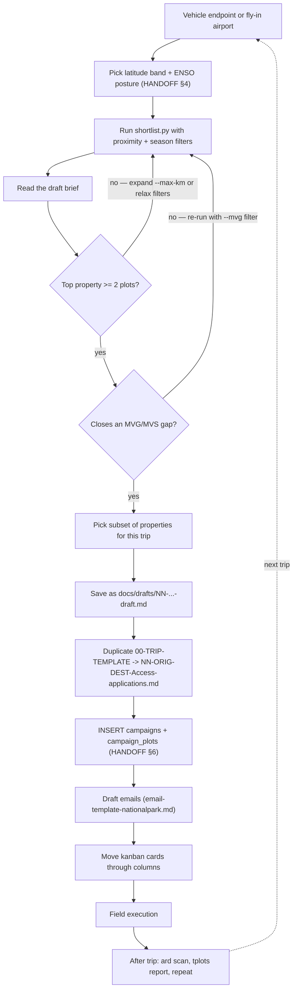

# Trip Planning Guide — DroneScape / TERN

This document explains how to use this repository — the scripts, databases,
and kanban boards — to plan a field trip from scratch. It sits between the
SQL/Python cookbook ([HANDOFF.md](../HANDOFF.md)), the quick-start paths
([README.md](../README.md)), and the kanban workflow trackers.

It also doubles as a prompt source for future Cursor agent sessions (see §7).

---

## 1. When to use this guide

- You've just finished (or are mid-) a field trip and need to plan the next leg.
- You're starting fresh after a season break and want to commit a new corridor
  to the roadmap.
- You want a Cursor agent to do most of the planning legwork — copy a prompt
  from [agent-prompts.md](agent-prompts.md).

---

## 2. Decision tree



---

## 3. Step-by-step

### Step 1 — Find the starting point

Query the last trip's vehicle endpoint from `campaigns.db`:

```sql
SELECT trip_id, route_dest, end_date
FROM campaigns
ORDER BY end_date DESC
LIMIT 1;
```

Or check [docs/campaign-roadmap.md](campaign-roadmap.md) for the anchored
chain. If flying into a fresh corridor, pick the nearest airport manually.

Reference lat/lon for common starting points:

| City | lat | lon |
|------|-----|-----|
| Adelaide | -34.93 | 138.60 |
| Brisbane | -27.47 | 153.03 |
| Broken Hill | -31.95 | 141.45 |
| Darwin | -12.46 | 130.84 |
| Hobart | -42.88 | 147.32 |
| Perth | -31.95 | 115.86 |
| Alice Springs | -23.70 | 133.88 |

### Step 2 — Decide season and ENSO posture

Per HANDOFF §4:
- **North of -23.5°** (above the Tropic) → field in **winter** (May-Sep).
  Dry season, workable tracks. Watch heat and fire risk in El Niño years.
- **South of -30°** → field in **summer** (Nov-Mar). More daylight, less cloud.
- The band between -23.5° and -30° is shoulder — use judgement.

Check the BoM ENSO outlook and log your assessment in `campaigns.enso_phase`
when you insert the trip row.

### Step 3 — Run a shortlist

```powershell
python scripts/shortlist.py `
    --seed-lat <LAT> --seed-lon <LON> --max-km <KM> `
    [--lat-min <X>] [--lat-max <Y>] `
    --top 25
```

Start with `--max-km 300`. If the brief has fewer than 5 properties, widen to
600 then 1000. For northern winter trips, add `--lat-min -23.5` to exclude
southern plots that would need a fly-in. For southern summer, add
`--lat-max -30`.

### Step 4 — Read the brief for permit + logistics leverage

The brief ranks by **`uncollected_plots DESC`** per `tp.plots.property`.
Each section is one landholder (national park, station, reserve, etc.) —
that is the permit/logistics unit:

- One property = one access application + one set of forms + one drive-in gate.
- A property with 10 uncollected plots is significantly lower complexity than
  10 single-plot properties even if the total scan time is identical.
- Use `--min-plots 2` (or 3) to filter out single-plot landholders and focus
  only on high-leverage targets.

**Do not** use the email address column as a complexity proxy. NPWS regional
inboxes often handle correspondence for multiple independent parks — each park
still needs its own approval, its own kanban card, and its own access date.

### Step 5 — Cross-check against MVG/MVS gaps

Run `tplots report` in `tern_plots_master` to get the current MVG/MVS gap
tables. Then re-run the shortlist with a vegetation filter:

```powershell
python scripts/shortlist.py `
    --seed-lat -31.95 --seed-lon 141.45 --max-km 400 `
    --mvg "Mallee Woodlands and Shrublands" `
    --top 10
```

A plot that closes a stratification gap may be worth prioritising even if its
property has only 1-2 uncollected plots.

### Step 6 — Assign trip-id, route, and dates

Follow the vehicle-chain rule from [docs/campaign-roadmap.md](campaign-roadmap.md):
trip N starts where trip N-1 ended. Format: `NN-ORIG-DEST-YYYY-MM`.

Save the final brief:

```powershell
python scripts/shortlist.py `
    --seed-lat <LAT> --seed-lon <LON> --max-km <KM> `
    [filters...] `
    --draft docs/drafts/NN-ORIG-DEST-draft.md `
    --trip-id NN-ORIG-DEST-YYYY-MM `
    --route "Origin -> Destination" `
    --dates "YYYY-MM-DD..YYYY-MM-DD" `
    --season <winter|summer|...> `
    --enso <neutral|nino|nina>
```

### Step 7 — Promote the draft to a kanban

Once you've decided which properties to pursue:

```powershell
Copy-Item boards/00-TRIP-TEMPLATE-Access-applications.md boards/NN-ORIG-DEST-Access-applications.md
```

Open the new file in Obsidian. Fill in the trip header card, then create one
kanban card per property selected from the draft. The card format follows the
template instructions: Organisation/owner · Tenure · Plot IDs · Channel.

**One card per `tp.plots.property`** — never split a property across cards.

### Step 8 — Persist the trip in campaigns.db

Insert the trip row and one row per plot using the SQL from HANDOFF.md §6:

```sql
INSERT INTO campaigns (trip_id, route_origin, route_dest, start_date, end_date, season, enso_phase)
VALUES ('NN-ORIG-DEST-YYYY-MM', 'Origin', 'Destination',
        'YYYY-MM-DD', 'YYYY-MM-DD', 'winter', 'neutral');

INSERT INTO campaign_plots (trip_id, plot) VALUES ('NN-ORIG-DEST-YYYY-MM', 'PLOTID');
-- one row per selected plot
```

These rows are what the next planning cycle reads in Step 1.

### Step 9 — Draft emails

Use [email-template-nationalpark.md](../templates/email-template-nationalpark.md) as the
base. **One email thread per `tp.plots.property`**, listing all plot IDs on
that landholder in the body. If two properties share an NPWS regional inbox,
mention the sibling reserve in prose if helpful, but each park still needs its
own approval workflow and kanban card.

Full copy-paste workflow (maps, attachments, kanban columns, Ask-mode prompts):
[outreach-workflow.md](outreach-workflow.md). Do **not** save per-property email
drafts in the repo — use the template + kanban + agent in Ask mode instead.

### Step 10 — Track approvals through the kanban

Move cards through the columns as access progresses:

`Properties` → `To Contact` → `Documents & Maps` → `Awaiting Response` → `Access Confirmed`

When a contact is confirmed, write the landholder details back to
`campaigns.db.properties` via SQL:

```sql
INSERT OR REPLACE INTO properties
    (property_name, email_address, tenure, jurisdiction, access_status)
VALUES ('Exact TERN Property Name', 'email@example.com', 'national park', 'NSW NPWS', 'confirmed');
```

The next shortlist run will then show `access_status` in the brief.

### Step 11 — Sync logistics itinerary (shared Excel CSV)

When the operational schedule is drafted or updated in the shared Excel workbook:

1. Download Sheet 1 as CSV → `docs/itineraries/<trip-id>-itinerary.csv`
2. `python scripts/import_itinerary.py --trip-id … --csv …` (use `--dry-run` first)
3. `python scripts/generate_checklist.py --trip-id …` for the UTAS logistics doc

See [itineraries/README.md](itineraries/README.md). Kanban stays the source for
**access**; the CSV is the source for **daily route, dates, and accommodation**.
Field day caps and late-approval tiers: [field-day-policy.md](field-day-policy.md).

### Step 12 — Post-trip refresh

After returning from the field:

1. Run `ds transfer` in `dronescape-sync` if colleagues pushed new data to R:.
2. Run `ard scan` in `dronescape_ard` to register collected plots.
3. Run `tplots report` in `tern_plots_master` to update gap tables.
4. Re-run `shortlist.py` for the next corridor — collected plots disappear
   from results automatically because `ard.level0_raw` now contains them.

---

## 4. Heuristics for common trade-offs

| Criterion | Repo lever |
|-----------|-----------|
| **Convenience / logistics** | Vehicle continuity (roadmap chain rule), seasonal latitude band, 10-12 day blocks. |
| **Cluster of sites** | `--seed-lat`/`--seed-lon`/`--max-km`. Smaller radius = tighter cluster = fewer driving days per plot. |
| **Uncollected MVG/MVS gaps** | `--mvg`/`--mvs` filter + `tplots report` gap tables (Concept 09). One gap-closing plot can outweigh several easy ones scientifically. |
| **Distance** | Same `--max-km` knob. Aim informally for <200 km of driving between consecutive plot days. |
| **Low permit complexity** | Sort by `uncollected_plots DESC`. High count on one `property` = one application. Use `--min-plots 2` to surface only multi-plot landholders. |
| **Same national park / property** | The brief groups by `tp.plots.property` already. One kanban card = one landholder = one permit. Never split. |
| **Shared email address** | Secondary, outreach only. The same NPWS inbox may cover unrelated parks; do not use it as a grouping or ranking criterion. |
| **Field day capacity** | Weekdays ≤11h, weekends ≤8h total working time; late permits: absorb, defer, or skip per [field-day-policy.md](field-day-policy.md). |

---

## 5. When results are thin

- Widen `--max-km` (300 → 600 → 1000).
- Drop `--mvg`/`--mvs` filters; re-rank by raw `uncollected_plots`.
- Check whether the corridor overlaps `"Crown Land"`, `"Unallocated Crown Land"`,
  or `"Not Collected"` buckets — these are placeholder names from the TERN export
  and need upstream disambiguation before they can be permitted.
- If still thin, the corridor is probably not the right fit this season. Flip
  the latitude band or pick a different seed.

---

## 6. When results are too dense

- Increase `--min-plots` (1 → 2 → 3) to surface only multi-plot landholders.
- Tighten `--max-km`.
- Split into two consecutive trips, parking the vehicle at a midpoint between
  the blocks.

---

## 7. Prompting a Cursor agent

See **[docs/agent-prompts.md](agent-prompts.md)** for copy-paste prompts.

## 8. Weekly active-trip check-in

1. `python scripts/trip_audit.py --trip-kanban boards/<your-trip>.md`
2. Open `docs/audits/<trip>-audit.md` — chase **Awaiting Response** cards older than ~7 days.
3. After fieldwork: `ard scan` upstream, re-run audit.

---

## 9. Key files at a glance

| File | Purpose |
|------|---------|
| [HANDOFF.md](../HANDOFF.md) | SQL/Python cookbook: schema, queries, UDFs |
| [README.md](../README.md) | DB paths, quick-start commands |
| `scripts/seed_campaigns.py` | Bootstrap `data/campaigns.db` schema |
| `scripts/shortlist.py` | Ranked shortlist + draft brief generator |
| `scripts/trip_audit.py` | Kanban vs TERN/ARD audit + optional `--register` |
| [docs/campaign-roadmap.md](campaign-roadmap.md) | Anchored chain + candidate pool |
| [docs/field-day-policy.md](field-day-policy.md) | Hour caps, late permits, deferral |
| [docs/agent-prompts.md](agent-prompts.md) | Cursor prompt library |
| `docs/drafts/` | Shortlist briefs (gitignored) |
| `docs/audits/` | Trip audit reports (gitignored) |
| `boards/00-TRIP-TEMPLATE-…` | Blank kanban for a new trip |
| `boards/NN-ORIG-DEST-…` | Active kanban for a confirmed trip |
| `templates/email-template-nationalpark.md` | Email base for permit outreach |
| [docs/outreach-workflow.md](outreach-workflow.md) | Maps + email copy-paste workflow |
