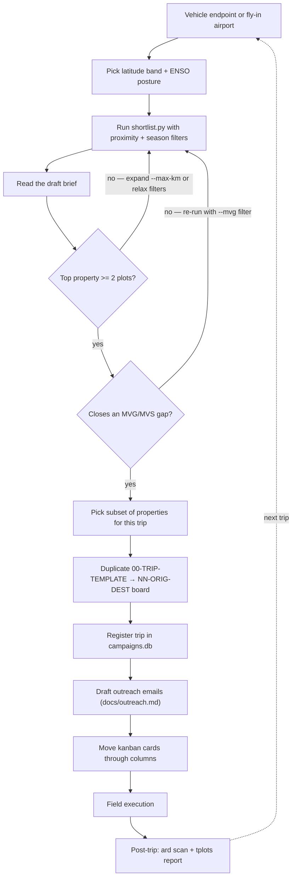

# Trip Planning Workflow

End-to-end guide for planning and preparing a DroneScape field trip —
from choosing a corridor to arriving on the first field day.

---

## Quick reference — common commands

```powershell
# Rank uncollected properties for a corridor
python scripts/shortlist.py --seed-lat -31.95 --seed-lon 141.45 --max-km 400 --top 25

# Save a draft brief (with trip header)
python scripts/shortlist.py `
    --seed-lat -31.95 --seed-lon 141.45 --max-km 400 `
    --draft docs/drafts/03-BRK-squeeze-draft.md `
    --trip-id 03-BRK-2026-08 `
    --route "Broken Hill loop" --dates "2026-08-10..2026-08-22" --season winter

# Audit kanban vs TERN + ARD (report only)
python scripts/trip_audit.py --trip-kanban boards/02-BRI-BRK-Access-applications.md

# Register trip in campaigns.db
python scripts/trip_audit.py --trip-kanban boards/02-BRI-BRK-Access-applications.md --register

# Sync itinerary CSV (dry-run first, then apply)
python scripts/import_itinerary.py --trip-id 02-BRI-BRK-2026-07 `
    --csv docs/itineraries/02-BRI-BRK-2026-07-itinerary.csv --dry-run
python scripts/import_itinerary.py --trip-id 02-BRI-BRK-2026-07 `
    --csv docs/itineraries/02-BRI-BRK-2026-07-itinerary.csv

# Generate checklist (Obsidian markdown + optional DOCX + maps)
python scripts/generate_checklist.py --trip-id 02-BRI-BRK-2026-07
python scripts/generate_checklist.py --trip-id 02-BRI-BRK-2026-07 --docx --maps
```

Output lands in `docs/checklists/`:
```
docs/checklists/
  02-BRI-BRK-2026-07-checklist.md       ← Obsidian working doc
  02-BRI-BRK-2026-07-checklist.docx     ← filled UTAS template for sign-off
  maps/
    02-BRI-BRK-2026-07-overview.png     ← all plots on OSM basemap
    02-BRI-BRK-2026-07-<Property>.png   ← per-property zoomed maps
```

> **DOCX template path:** set `TEMPLATE_DOCX` in `src/dronescape_planning/paths.py`
> (default: Desktop).

---

## Planning decision tree



---

## Step-by-step

### 1 — Find the starting point

Query the last trip's vehicle endpoint:

```sql
SELECT trip_id, route_dest, end_date FROM campaigns ORDER BY end_date DESC LIMIT 1;
```

Or check [docs/campaign-roadmap.md](campaign-roadmap.md). Common starting points:

| City | lat | lon |
|------|-----|-----|
| Adelaide | -34.93 | 138.60 |
| Brisbane | -27.47 | 153.03 |
| Broken Hill | -31.95 | 141.45 |
| Darwin | -12.46 | 130.84 |
| Alice Springs | -23.70 | 133.88 |

### 2 — Pick season and ENSO posture

- **North of -23.5°** → field in **winter** (May–Sep). Dry, workable tracks.
- **South of -30°** → field in **summer** (Nov–Mar). More daylight, less cloud.
- Shoulder band (-23.5° to -30°): use judgement.

Check BoM ENSO outlook; log the posture in `campaigns.enso_phase`.

### 3 — Run the shortlist

```powershell
python scripts/shortlist.py `
    --seed-lat <LAT> --seed-lon <LON> --max-km 300 `
    [--lat-min <X>] [--lat-max <Y>] [--mvg "..."] `
    --top 25
```

Start with `--max-km 300`. Widen to 600 → 1000 if the brief has fewer than 5 properties.
Add `--min-plots 2` to surface only multi-plot landholders. Results too dense? Tighten
`--max-km` or raise `--min-plots`.

### 4 — Review the brief

The brief ranks by **`uncollected_plots DESC`** per `tp.plots.property`.
One property = one access application + one kanban card + one email thread.
Cross-check against MVG/MVS gap tables from `tplots report` — a gap-closing plot
can outweigh several easy ones scientifically.

### 5 — Assign trip-id, save the draft

Trip N starts where trip N-1 ended. Format: `NN-ORIG-DEST-YYYY-MM`.

```powershell
python scripts/shortlist.py `
    --seed-lat <LAT> --seed-lon <LON> --max-km <KM> [filters...] `
    --draft docs/drafts/NN-ORIG-DEST-draft.md `
    --trip-id NN-ORIG-DEST-YYYY-MM `
    --route "Origin → Destination" `
    --dates "YYYY-MM-DD..YYYY-MM-DD" `
    --season <winter|summer> --enso <neutral|nino|nina>
```

### 6 — Create the kanban board

```powershell
Copy-Item boards/00-TRIP-TEMPLATE-Access-applications.md `
          boards/NN-ORIG-DEST-Access-applications.md
```

Open in Obsidian. Fill the trip header card, then create one card per selected property.
Card format: Organisation/owner · Tenure · Plot IDs · Channel.
**One card per `tp.plots.property` — never split a property across cards.**

### 7 — Register the trip in campaigns.db

```sql
INSERT INTO campaigns (trip_id, route_origin, route_dest, start_date, end_date, season, enso_phase)
VALUES ('NN-ORIG-DEST-YYYY-MM', 'Origin', 'Destination',
        'YYYY-MM-DD', 'YYYY-MM-DD', 'winter', 'neutral');

-- One row per selected plot
INSERT INTO campaign_plots (trip_id, plot) VALUES ('NN-ORIG-DEST-YYYY-MM', 'PLOTID');
```

### 8 — Draft and send outreach emails

See **[docs/outreach.md](outreach.md)** for the full send checklist, template, and
Ask-mode agent prompt.

### 9 — Move kanban cards

`Properties` → `To Contact` → `Documents & Maps` → `Awaiting Response` → `Access Confirmed`

When confirmed, write contact details back to `campaigns.db`:

```sql
INSERT OR REPLACE INTO properties
    (property_name, email_address, tenure, jurisdiction, access_status)
VALUES ('Exact TERN Property Name', 'email@example.com', 'national park', 'NSW NPWS', 'confirmed');
```

### 10 — Sync the logistics itinerary (shared Excel)

1. Download Sheet 1 as CSV → `docs/itineraries/<trip-id>-itinerary.csv`
2. **Generate KMZ for review** (optional, before import):
   ```powershell
   ds-generate-kml --trip-id <trip-id> --csv docs/itineraries/<trip-id>-itinerary.csv
   # Iteration: add --label v1, v2, etc. to keep versions in docs/itineraries/maps/
   ```
   Open `.kmz` in Google Earth to compare routes. Layer two labelled versions to pick the best schedule.
3. Dry-run: `python scripts/import_itinerary.py --trip-id … --csv … --dry-run`
4. Review `docs/audits/<trip-id>-itinerary-feedback.md`
5. Apply: `python scripts/import_itinerary.py --trip-id … --csv …`
6. Regenerate checklist: `python scripts/generate_checklist.py --trip-id …`
7. **Final trip KMZ** (boss preview of upcoming route): `ds-generate-kml --trip-id … --csv …` (no `--label`)

**Kanban** = source of truth for access. **CSV** = source of truth for daily route,
dates, and accommodation.

### 11 — Post-trip refresh

```powershell
# After returning / new data on R:
ds transfer                      # (in dronescape-sync, if needed)
ard scan                         # (in dronescape_ard)
tplots report --db data/tern_plots.db --output-dir docs/reports   # (in tern_plots_master)
ds-generate-kml --collected       # refresh national collected footprint KMZ for bosses
# Then re-run shortlist for the next corridor — collected plots disappear automatically
```

---

## Weekly active-trip check-in

```powershell
python scripts/trip_audit.py --trip-kanban boards/<your-trip>.md
```

Open `docs/audits/<trip>-audit.md`. Chase **Awaiting Response** cards older than ~7 days.
Dangerous mismatch: a plot **on the daily Excel schedule** while its kanban card is still
**Awaiting Response** — do not field until confirmed or removed from Excel.

---

## Field day caps + late permits

| Day type | Working time cap |
|----------|-----------------|
| Weekday (Mon–Fri) | ≤ 11 hours |
| Weekend (Sat–Sun) | ≤ 8 hours |

When a permit arrives late, choose one outcome:

| Outcome | When |
|---------|------|
| **Absorb** | Site fits current corridor and the day stays under the cap |
| **Defer** | Trip is over cap or the site lies on the **next anchored leg** |
| **Skip** | No corridor fit, permit can't cover the window, or low priority |
| **Re-approve** | Change affects accommodation, trip dates, or hard anchors |

Defer checklist (short version):
1. Next trip route passes the property outbound — not as a detour.
2. Permit window covers the next trip dates; email ranger if the month shifted.
3. Update source kanban: `Access Confirmed · Deferred → <next-trip-id>`
4. Add carryover card on the next kanban: `Carryover from <prior-trip-id>`
5. Tag `DEFERRED → <trip-id>` in the Excel site master; remove from current daily rows.

Team Lead one-liner template:
> *[Property]* approved. [Absorb on DATE / Defer to TRIP-ID / Skip — reason].
> [No accommodation change / Tier 1 notify / Tier 2 — needs sign-off].

---

## Agent prompts (copy-paste)

**Audit + register an active trip:**
> Run `python scripts/trip_audit.py --trip-kanban boards/02-BRI-BRK-Access-applications.md --register`
> and summarize what still needs a follow-up email.

**Sync itinerary CSV:**
> Import `docs/itineraries/02-BRI-BRK-2026-07-itinerary.csv` for trip `02-BRI-BRK-2026-07`,
> regenerate the checklist, and show me the feedback file to share with the team.

**Plan next corridor:**
> Plan the next trip starting from Broken Hill for winter 2026. Run `scripts/shortlist.py`
> with `--seed-lat -31.95 --seed-lon 141.45 --max-km 400`. Produce a draft brief and
> propose 3 candidate routes ranked by uncollected plot count and MVG/MVS gap closure.

**Late permit decision:**
> Read `docs/campaign-roadmap.md`. A property on `boards/02-BRI-BRK-Access-applications.md`
> just moved to Access Confirmed after the itinerary was lead-approved. Tell me whether to
> absorb, defer to the next anchored leg, or skip — check hour caps (11h weekday / 8h
> weekend). If absorbing, run `import_itinerary.py --dry-run` and show itinerary feedback.
